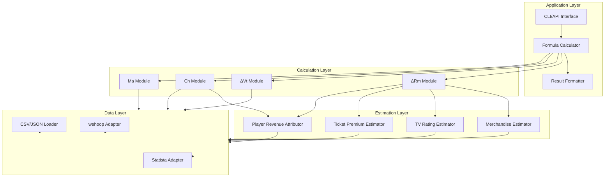

# Brand Portability Formula - Design Document

## Overview

The Brand Portability Formula system calculates χ (chi), a metric that quantifies a player's potential impact on team value and revenue when traded to a new market. The system implements the formula:

**χ = Ch ⋅ Ma / (ΔRm + ΔVt)**

This design follows a modular architecture where each variable (ΔRm, ΔVt, Ch, Ma) is implemented as an independent module with clear interfaces. The system ingests data from multiple sources (wehoop R package, Statista datasets, local CSV/JSON files) and produces interpretable results with full transparency into intermediate calculations.

## Architecture

### High-Level Architecture

The system follows a layered architecture with clear separation of concerns:



### Design Principles

1. **Modularity**: Each variable calculation is isolated in its own module
2. **Testability**: All modules have clear inputs/outputs for unit and property testing
3. **Transparency**: Intermediate values are exposed for interpretation
4. **Extensibility**: New data sources or estimation methods can be added without modifying core logic
5. **Error Resilience**: Graceful handling of missing data, zero values, and edge cases

## Components and Interfaces

### 1. Data Layer

#### 1.1 Data Models

**PlayerData**
```python
@dataclass
class PlayerData:
    player_id: str
    player_name: str
    annual_records: List[PlayerAnnualRecord]
    
@dataclass
class PlayerAnnualRecord:
    year: int
    team_id: str
    points_per_game: float
    games_played: int
    minutes_per_game: float
    salary: float
    scoring_percentile: Optional[float] = None
```

**TeamData**
```python
@dataclass
class TeamData:
    team_id: str
    team_name: str
    market_tier: int  # 1, 2, or 3
    dma_ranking: int
    annual_records: List[TeamAnnualRecord]
    
@dataclass
class TeamAnnualRecord:
    year: int
    valuation: float
    revenue: float
    attendance_avg: float
    points_per_game: float
```

**LeagueData**
```python
@dataclass
class LeagueData:
    annual_records: List[LeagueAnnualRecord]
    
@dataclass
class LeagueAnnualRecord:
    year: int
    avg_viewership: float
    avg_attendance: float
    avg_salary: float
    total_teams: int
```

**MarketTierData**
```python
@dataclass
class MarketTierData:
    tier: int  # 1, 2, or 3
    adjustment_factor: float  # 1.25, 1.0, or 0.85
    teams: List[str]
```

#### 1.2 Data Loaders

**CSVLoader**
```python
class CSVLoader:
    def load_forbes_valuations(self, filepath: str) -> List[TeamAnnualRecord]:
        """Load Forbes team valuation data from CSV"""
        pass
    
    def load_market_tiers(self, filepath: str) -> Dict[str, MarketTierData]:
        """Load market tier classifications from CSV"""
        pass
```

**JSONLoader**
```python
class JSONLoader:
    def load_market_tiers_2024(self, filepath: str) -> Dict[str, Any]:
        """Load 2024 market tiers data"""
        pass
    
    def load_market_tiers_2026(self, filepath: str) -> Dict[str, Any]:
        """Load 2026 market tiers projections"""
        pass
```

**WEHOOPAdapter**
```python
class WEHOOPAdapter:
    def fetch_player_stats(self, player_id: str, start_year: int, end_year: int) -> PlayerData:
        """Fetch player statistics from wehoop package"""
        pass
    
    def fetch_team_stats(self, team_id: str, start_year: int, end_year: int) -> TeamData:
        """Fetch team statistics from wehoop package"""
        pass
```

**StatistaAdapter**
```python
class StatistaAdapter:
    def get_viewership_data(self, year: int) -> float:
        """Get league viewership for a given year"""
        pass
    
    def get_attendance_data(self, team_id: str, year: int) -> float:
        """Get team attendance for a given year"""
        pass
    
    def get_salary_data(self, player_id: str, year: int) -> float:
        """Get player salary for a given year"""
        pass
```

### 2. Estimation Layer

#### 2.1 Merchandise Sales Estimator

```python
class MerchandiseEstimator:
    def estimate_sales(
        self,
        scoring_percentile: float,
        salary_percentile: float,
        market_tier_factor: float,
        league_revenue_baseline: float
    ) -> float:
        """
        Estimate player-specific merchandise sales
        
        Formula: Merchandise Sales = (Scoring % × Salary % × Market Tier Factor) × League Revenue Baseline × 0.05
        
        Args:
            scoring_percentile: Player's scoring percentile (0.0 to 1.0)
            salary_percentile: Player's salary percentile (0.0 to 1.0)
            market_tier_factor: Market adjustment (1.25, 1.0, or 0.85)
            league_revenue_baseline: Average team revenue from Forbes data
            
        Returns:
            Estimated annual merchandise sales attributable to player
        """
        pass
```

#### 2.2 TV Rating Impact Estimator

```python
class TVRatingEstimator:
    def estimate_impact(
        self,
        scoring_percentile: float,
        salary_percentile: float,
        social_media_index: float,
        league_viewership_growth: float,
        market_reach_factor: float
    ) -> float:
        """
        Estimate player-specific TV rating impact
        
        Formula: TV Rating Impact = (Star Power Score) × (League Viewership Growth) × (Market Reach Factor)
        Star Power = (Scoring % × 0.4) + (Salary % × 0.3) + (Social Media Index × 0.3)
        
        Args:
            scoring_percentile: Player's scoring percentile (0.0 to 1.0)
            salary_percentile: Player's salary percentile (0.0 to 1.0)
            social_media_index: Normalized social media engagement (0.0 to 1.0)
            league_viewership_growth: Year-over-year viewership growth rate
            market_reach_factor: Based on DMA ranking (0.5 to 1.5)
            
        Returns:
            Estimated TV rating impact in dollars
        """
        pass
```

#### 2.3 Ticket Premium Estimator

```python
class TicketPremiumEstimator:
    def estimate_premium(
        self,
        attendance_with_player: float,
        attendance_without_player: float,
        avg_ticket_price: float,
        player_performance_weight: float,
        star_power_multiplier: float,
        home_games: int
    ) -> float:
        """
        Estimate player-specific ticket premium
        
        Formula: Ticket Premium = (Attendance Diff) × (Avg Ticket Price) × (Attribution Factor) × (Home Games)
        Attribution Factor = (Player Performance Weight) × (Star Power Multiplier)
        
        Args:
            attendance_with_player: Average attendance with player on roster
            attendance_without_player: Average attendance without player
            avg_ticket_price: Average ticket price for team
            player_performance_weight: Player's contribution weight (0.0 to 1.0)
            star_power_multiplier: Star power adjustment (0.5 to 2.0)
            home_games: Number of home games per season
            
        Returns:
            Estimated annual ticket premium attributable to player
        """
        pass
```

#### 2.4 Player Revenue Attribution Estimator

```python
class PlayerRevenueAttributor:
    def calculate_attribution(
        self,
        team_revenue_change: float,
        player_ppg: float,
        team_ppg: float,
        player_salary: float,
        team_salary_cap: float,
        games_played: int,
        total_games: int,
        minutes_per_game: float
    ) -> float:
        """
        Calculate player's attributed share of team revenue change
        
        Formula: Player Revenue Impact = (Team Revenue Change) × (Performance Weight) × (Playing Time %)
        Performance Weight = (Player PPG / Team PPG) × 0.6 + (Player Salary / Team Cap) × 0.4
        Playing Time % = (Games Played / Total Games) × (Minutes Per Game / 40)
        
        Args:
            team_revenue_change: Year-over-year revenue change
            player_ppg: Player points per game
            team_ppg: Team points per game
            player_salary: Player's annual salary
            team_salary_cap: Team's total salary cap
            games_played: Games player participated in
            total_games: Total games in season
            minutes_per_game: Player's average minutes per game
            
        Returns:
            Player's attributed revenue impact
        """
        pass
```

### 3. Calculation Layer

#### 3.1 ΔRm Module (Revenue Delta)

```python
class RevenueDeltaCalculator:
    def __init__(
        self,
        merchandise_estimator: MerchandiseEstimator,
        tv_rating_estimator: TVRatingEstimator,
        ticket_premium_estimator: TicketPremiumEstimator
    ):
        self.merchandise_estimator = merchandise_estimator
        self.tv_rating_estimator = tv_rating_estimator
        self.ticket_premium_estimator = ticket_premium_estimator
    
    def calculate(
        self,
        player_data: PlayerData,
        new_team_data: TeamData,
        league_data: LeagueData
    ) -> RevenueDeltaResult:
        """
        Calculate revenue delta: new city revenue minus career average revenue
        
        Steps:
        1. Calculate career average revenue metrics
        2. Estimate new city-specific revenue impact
        3. Compute delta between new city and career average
        
        Returns:
            RevenueDeltaResult with breakdown of components
        """
        pass

@dataclass
class RevenueDeltaResult:
    total_delta: float
    career_avg_revenue: float
    new_city_revenue: float
    components: Dict[str, float]  # merchandise, tv_rating, ticket_premium
```

#### 3.2 ΔVt Module (Team Value Lift)

```python
class TeamValueLiftCalculator:
    def calculate(
        self,
        team_data: TeamData,
        league_data: LeagueData,
        prior_year: int,
        current_year: int
    ) -> TeamValueLiftResult:
        """
        Calculate team value lift: team growth minus league average growth
        
        Steps:
        1. Calculate team's year-over-year valuation change
        2. Calculate league-average growth rate
        3. Compute net lift (team growth - league average)
        
        Returns:
            TeamValueLiftResult with breakdown
        """
        pass
    
    def calculate_league_avg_growth(
        self,
        league_data: LeagueData,
        prior_year: int,
        current_year: int
    ) -> float:
        """
        Calculate league-average growth rate
        
        Formula: Σ(Team Valuation Change) / Number of Teams / Prior Year Avg Valuation
        """
        pass

@dataclass
class TeamValueLiftResult:
    net_lift: float
    team_growth_rate: float
    league_avg_growth_rate: float
    team_valuation_prior: float
    team_valuation_current: float
```

#### 3.3 Ch Module (Career Historical Baseline)

```python
class CareerBaselineCalculator:
    def __init__(self, revenue_attributor: PlayerRevenueAttributor):
        self.revenue_attributor = revenue_attributor
    
    def calculate(
        self,
        player_data: PlayerData,
        team_data_history: List[TeamData]
    ) -> CareerBaselineResult:
        """
        Calculate player's career historical baseline
        
        Steps:
        1. Aggregate player career data across all teams
        2. Calculate annual commercial output for each year
        3. Compute average annual output
        
        Returns:
            CareerBaselineResult with year-by-year breakdown
        """
        pass

@dataclass
class CareerBaselineResult:
    avg_annual_output: float
    total_years: int
    annual_breakdown: List[Tuple[int, float]]  # (year, output)
```

#### 3.4 Ma Module (Market Adjustment Factor)

```python
class MarketAdjustmentCalculator:
    def calculate(
        self,
        team_data: TeamData,
        market_tier_data: MarketTierData,
        player_contribution_weight: float
    ) -> MarketAdjustmentResult:
        """
        Calculate market adjustment factor
        
        Steps:
        1. Get base market tier factor (1.25, 1.0, or 0.85)
        2. Adjust for DMA ranking
        3. Factor in player contribution weight
        4. Normalize to ensure fair comparison across markets
        
        Returns:
            MarketAdjustmentResult with breakdown
        """
        pass

@dataclass
class MarketAdjustmentResult:
    adjustment_factor: float
    base_tier_factor: float
    dma_adjustment: float
    player_contribution_weight: float
```

### 4. Application Layer

#### 4.1 Formula Calculator

```python
class BrandPortabilityCalculator:
    def __init__(
        self,
        revenue_delta_calc: RevenueDeltaCalculator,
        team_value_lift_calc: TeamValueLiftCalculator,
        career_baseline_calc: CareerBaselineCalculator,
        market_adjustment_calc: MarketAdjustmentCalculator
    ):
        self.revenue_delta_calc = revenue_delta_calc
        self.team_value_lift_calc = team_value_lift_calc
        self.career_baseline_calc = career_baseline_calc
        self.market_adjustment_calc = market_adjustment_calc
    
    def calculate_portability(
        self,
        player_data: PlayerData,
        new_team_data: TeamData,
        league_data: LeagueData,
        market_tier_data: MarketTierData
    ) -> BrandPortabilityResult:
        """
        Calculate brand portability score χ
        
        Formula: χ = Ch ⋅ Ma / (ΔRm + ΔVt)
        
        Steps:
        1. Calculate all component variables
        2. Apply formula
        3. Handle edge cases (division by zero, negative values)
        4. Return structured result with all intermediate values
        
        Returns:
            BrandPortabilityResult with full breakdown
        """
        pass
    
    def _handle_edge_cases(
        self,
        ch: float,
        ma: float,
        delta_rm: float,
        delta_vt: float
    ) -> Tuple[float, Optional[str]]:
        """
        Handle edge cases in formula calculation
        
        Cases:
        - Division by zero: If ΔRm + ΔVt = 0, apply epsilon (0.01)
        - Negative denominator: If ΔRm + ΔVt < 0, return warning
        - Zero career baseline: If Ch = 0, return error
        
        Returns:
            (calculated_chi, warning_message)
        """
        pass

@dataclass
class BrandPortabilityResult:
    chi: float
    components: ComponentBreakdown
    formula: str
    interpretation: str
    warnings: List[str]

@dataclass
class ComponentBreakdown:
    career_baseline: CareerBaselineResult
    market_adjustment: MarketAdjustmentResult
    revenue_delta: RevenueDeltaResult
    team_value_lift: TeamValueLiftResult
```

#### 4.2 Result Formatter

```python
class ResultFormatter:
    def to_json(self, result: BrandPortabilityResult) -> str:
        """Format result as JSON string"""
        pass
    
    def to_dict(self, result: BrandPortabilityResult) -> Dict[str, Any]:
        """Format result as dictionary"""
        pass
    
    def to_readable_text(self, result: BrandPortabilityResult) -> str:
        """Format result as human-readable text with interpretation"""
        pass
    
    def generate_interpretation(self, chi: float) -> str:
        """
        Generate interpretation based on chi value
        
        Ranges:
        - χ > 3.0: Exceptional portability - star player with massive market impact
        - 2.0 < χ ≤ 3.0: High portability - significant impact expected
        - 1.0 < χ ≤ 2.0: Moderate portability - average impact
        - 0.5 < χ ≤ 1.0: Low portability - limited impact
        - χ ≤ 0.5: Minimal portability - negligible impact
        """
        pass
```

## Data Models

### Input Data Structures

All data models are defined in the Components section above. Key structures:
- `PlayerData`: Player career statistics and performance
- `TeamData`: Team valuations, revenue, and market information
- `LeagueData`: League-wide averages and trends
- `MarketTierData`: Market tier classifications and adjustment factors

### Output Data Structure

```json
{
  "brandPortability": 2.45,
  "components": {
    "careerBaseline": {
      "avgAnnualOutput": 5000000,
      "totalYears": 5,
      "annualBreakdown": [
        [2020, 4500000],
        [2021, 4800000],
        [2022, 5200000],
        [2023, 5300000],
        [2024, 5200000]
      ]
    },
    "marketAdjustment": {
      "adjustmentFactor": 1.2,
      "baseTierFactor": 1.25,
      "dmaAdjustment": 0.96,
      "playerContributionWeight": 0.35
    },
    "revenueDelta": {
      "totalDelta": 3000000,
      "careerAvgRevenue": 5000000,
      "newCityRevenue": 8000000,
      "components": {
        "merchandise": 1200000,
        "tvRating": 1000000,
        "ticketPremium": 800000
      }
    },
    "teamValueLift": {
      "netLift": 2000000,
      "teamGrowthRate": 0.25,
      "leagueAvgGrowthRate": 0.18,
      "teamValuationPrior": 100000000,
      "teamValuationCurrent": 125000000
    }
  },
  "formula": "χ = Ch ⋅ Ma / (ΔRm + ΔVt)",
  "interpretation": "High portability - player likely to have significant impact in new market",
  "warnings": []
}
```


## Correctness Properties

*A property is a characteristic or behavior that should hold true across all valid executions of a system—essentially, a formal statement about what the system should do. Properties serve as the bridge between human-readable specifications and machine-verifiable correctness guarantees.*

### Property 1: Formula Calculation Correctness

*For any* valid career baseline (Ch > 0), market adjustment (Ma > 0), revenue delta (ΔRm), and team value lift (ΔVt) where ΔRm + ΔVt ≠ 0, the calculated brand portability χ should equal Ch ⋅ Ma / (ΔRm + ΔVt).

**Validates: Requirements - Acceptance Criteria 2**

### Property 2: Revenue Delta Calculation

*For any* player with career history and any new team, the revenue delta (ΔRm) should equal the estimated new city revenue minus the player's career average revenue.

**Validates: Requirements - ΔRm Definition**

### Property 3: Team Value Lift Calculation

*For any* team with valuation history and league data, the team value lift (ΔVt) should equal the team's growth rate minus the league average growth rate.

**Validates: Requirements - ΔVt Definition**

### Property 4: Career Baseline Calculation

*For any* player with multiple years of career data, the career baseline (Ch) should equal the arithmetic mean of all annual commercial outputs.

**Validates: Requirements - Ch Definition**

### Property 5: Market Adjustment Calculation

*For any* team with market tier classification, DMA ranking, and player contribution weight, the market adjustment (Ma) should incorporate all three factors in the final value.

**Validates: Requirements - Ma Definition**

### Property 6: Merchandise Sales Estimation Formula

*For any* valid scoring percentile (0.0 to 1.0), salary percentile (0.0 to 1.0), market tier factor (0.85, 1.0, or 1.25), and league revenue baseline (> 0), the estimated merchandise sales should equal (scoring percentile × salary percentile × market tier factor × league revenue baseline × 0.05).

**Validates: Requirements - Estimation Methods 1**

### Property 7: Player Revenue Attribution Formula

*For any* team revenue change, player performance metrics (PPG, salary), and playing time data, the attributed player revenue impact should equal (team revenue change) × (performance weight) × (playing time percentage), where performance weight = (player PPG / team PPG) × 0.6 + (player salary / team salary cap) × 0.4.

**Validates: Requirements - Estimation Methods 2**

### Property 8: TV Rating Impact Estimation Formula

*For any* valid scoring percentile, salary percentile, social media index (all 0.0 to 1.0), league viewership growth, and market reach factor, the TV rating impact should equal (star power score) × (league viewership growth) × (market reach factor), where star power score = (scoring percentile × 0.4) + (salary percentile × 0.3) + (social media index × 0.3).

**Validates: Requirements - Estimation Methods 3**

### Property 9: Ticket Premium Estimation Formula

*For any* attendance differential, average ticket price, attribution factor, and number of home games, the ticket premium should equal (attendance differential) × (average ticket price) × (attribution factor) × (home games).

**Validates: Requirements - Estimation Methods 4**

### Property 10: League Average Growth Rate Calculation

*For any* set of team valuations across two years, the league average growth rate should equal the sum of all team valuation changes divided by the number of teams divided by the prior year average valuation.

**Validates: Requirements - Estimation Methods 5**

### Property 11: Non-Negative Career Baseline

*For any* player with valid career data (positive annual outputs), the career baseline (Ch) should always be greater than zero.

**Validates: Requirements - Ch Definition, Edge Cases**

### Property 12: Market Adjustment Factor Bounds

*For any* valid market tier (1, 2, or 3), the base market adjustment factor should be one of the three valid values: 1.25 (Tier 1), 1.0 (Tier 2), or 0.85 (Tier 3).

**Validates: Requirements - Ma Definition**

### Property 13: Revenue Delta Components Sum

*For any* revenue delta calculation, the total delta should equal the sum of merchandise sales estimate, TV rating impact estimate, and ticket premium estimate minus the career average of these same components.

**Validates: Requirements - ΔRm Definition, Components**

### Property 14: Positive Denominator Handling

*For any* calculation where ΔRm + ΔVt equals zero, the system should apply an epsilon adjustment (0.01) to prevent division by zero, and the result should include a warning message.

**Validates: Requirements - Edge Cases, Acceptance Criteria 4**

### Property 15: Output Structure Completeness

*For any* successful brand portability calculation, the output should contain all required fields: brandPortability (chi value), components (with all four sub-components), formula string, interpretation string, and warnings array.

**Validates: Requirements - Output Requirements, Acceptance Criteria 5**

## Error Handling

### Error Categories

**1. Data Validation Errors**
- Missing required fields in input data
- Invalid data types (non-numeric values where numbers expected)
- Out-of-range values (negative percentiles, invalid market tiers)
- Insufficient historical data (fewer than minimum required years)

**2. Calculation Errors**
- Zero career baseline (Ch = 0): Return error with message "Cannot calculate portability: player has zero career baseline"
- Division by zero (ΔRm + ΔVt = 0): Apply epsilon (0.01) and return warning "Denominator near zero, applied epsilon adjustment"
- Negative denominator (ΔRm + ΔVt < 0): Calculate result but return warning "Negative denominator detected: revenue delta and team value lift are both negative"

**3. Data Source Errors**
- File not found: Return error with filepath
- Malformed CSV/JSON: Return error with parsing details
- API/package unavailable: Return error with connection details

### Error Response Format

```python
@dataclass
class CalculationError:
    error_type: str  # "validation", "calculation", "data_source"
    message: str
    details: Optional[Dict[str, Any]] = None
    
@dataclass
class CalculationWarning:
    warning_type: str
    message: str
    affected_component: str
```

### Error Handling Strategy

**Fail Fast for Critical Errors:**
- Zero career baseline → Raise exception immediately
- Missing required data fields → Raise exception immediately
- Invalid data types → Raise exception immediately

**Graceful Degradation for Warnings:**
- Division by zero → Apply epsilon, continue with warning
- Negative denominator → Calculate result, include warning
- Missing optional data → Use fallback values, include warning

**Retry Logic for Data Sources:**
- File I/O errors → Retry up to 3 times with exponential backoff
- API/package errors → Retry up to 3 times, then fail with clear message

## Testing Strategy

### Dual Testing Approach

This system requires both unit tests and property-based tests for comprehensive coverage:

**Unit Tests** focus on:
- Specific examples with known expected outputs
- Edge cases (zero values, boundary conditions)
- Error conditions (missing data, invalid inputs)
- Integration points between modules

**Property-Based Tests** focus on:
- Universal properties that hold for all valid inputs
- Formula correctness across wide input ranges
- Invariants that must be maintained
- Relationship properties between components

Both testing approaches are complementary and necessary. Unit tests catch concrete bugs with specific inputs, while property tests verify general correctness across thousands of randomized inputs.

### Property-Based Testing Configuration

**Testing Library:** Use `hypothesis` for Python (or equivalent for chosen language)

**Test Configuration:**
- Minimum 100 iterations per property test (due to randomization)
- Each property test must reference its design document property
- Tag format: `# Feature: brand-portability-formula, Property {number}: {property_text}`

**Example Property Test Structure:**

```python
from hypothesis import given, strategies as st

# Feature: brand-portability-formula, Property 1: Formula Calculation Correctness
@given(
    ch=st.floats(min_value=0.01, max_value=1e9),
    ma=st.floats(min_value=0.01, max_value=2.0),
    delta_rm=st.floats(min_value=-1e9, max_value=1e9),
    delta_vt=st.floats(min_value=-1e9, max_value=1e9)
)
def test_formula_calculation_correctness(ch, ma, delta_rm, delta_vt):
    # Ensure denominator is not zero
    assume(abs(delta_rm + delta_vt) > 0.001)
    
    calculator = BrandPortabilityCalculator(...)
    result = calculator.calculate_portability(...)
    
    expected_chi = (ch * ma) / (delta_rm + delta_vt)
    assert abs(result.chi - expected_chi) < 0.01  # Allow small floating point error
```

### Unit Test Coverage

**Module-Level Tests:**
- `RevenueDeltaCalculator`: Test with known player/team data, verify component breakdown
- `TeamValueLiftCalculator`: Test with known valuation histories, verify league average calculation
- `CareerBaselineCalculator`: Test with known career data, verify average calculation
- `MarketAdjustmentCalculator`: Test with known market tiers, verify factor application

**Estimator Tests:**
- `MerchandiseEstimator`: Test formula with known inputs, verify output
- `TVRatingEstimator`: Test star power calculation, verify weighting
- `TicketPremiumEstimator`: Test attribution factor calculation
- `PlayerRevenueAttributor`: Test performance weight and playing time calculations

**Edge Case Tests:**
- Zero career baseline → Should raise exception
- Division by zero → Should apply epsilon and warn
- Negative denominator → Should calculate and warn
- Missing data → Should handle gracefully or error appropriately
- Single year of data → Should handle or require minimum years

**Integration Tests:**
- End-to-end calculation with real data samples
- Data loader integration with actual CSV/JSON files
- Multiple player scenarios across different market tiers

### Test Data Strategy

**Synthetic Data Generation:**
- Generate realistic player statistics within valid ranges
- Generate team valuations following realistic growth patterns
- Generate league data with consistent year-over-year trends

**Real Data Samples:**
- Include test fixtures with actual 2024-2025 WNBA data
- Use known player examples (e.g., Caitlin Clark to Indiana Fever)
- Validate against documented real-world scenarios

**Edge Case Data:**
- Boundary values (zero, negative, very large numbers)
- Missing data scenarios
- Incomplete historical records

## Implementation Notes

### Technology Stack Considerations

**Language Selection:** Python is recommended due to:
- Strong data science ecosystem (pandas, numpy)
- Native R integration for wehoop package (via rpy2)
- Excellent testing libraries (pytest, hypothesis)
- JSON/CSV handling built-in

**Alternative:** TypeScript/JavaScript if web integration is priority

### Data Pipeline

**Data Flow:**
1. Load raw data from sources (CSV, JSON, wehoop, Statista)
2. Transform into standardized data models
3. Validate data completeness and ranges
4. Pass to calculation modules
5. Aggregate results
6. Format output

**Caching Strategy:**
- Cache wehoop API responses to avoid repeated calls
- Cache Forbes valuation data (updates annually)
- Cache market tier classifications (updates infrequently)

### Performance Considerations

**Expected Performance:**
- Single player calculation: < 100ms
- Batch calculation (10 players): < 1 second
- Data loading: < 500ms (with caching)

**Optimization Opportunities:**
- Vectorize calculations using numpy for batch processing
- Lazy load data sources (only load what's needed)
- Parallel processing for multiple player calculations

### Extensibility Points

**Adding New Data Sources:**
- Implement new adapter class following existing interface
- Register adapter in data layer
- No changes needed to calculation layer

**Adding New Estimation Methods:**
- Implement new estimator class
- Inject into relevant calculator
- Update component breakdown structure

**Adding New Variables:**
- Create new calculator module
- Update formula calculator to incorporate new variable
- Update output structure

### Validation and Quality Assurance

**Cross-Validation Methods:**

1. **Attendance Correlation Analysis**
   - Compare estimated ticket premiums with actual attendance data
   - Calculate correlation coefficient (target: r > 0.7)
   - Flag estimates with poor correlation for review

2. **Valuation Jump Analysis**
   - Teams with star player additions should show larger valuation increases
   - Compare calculated impact to actual valuation changes
   - Example: Indiana Fever +311% (2024→2025) should correlate with high χ for Caitlin Clark

3. **Revenue Multiple Consistency**
   - Check if estimated player impacts align with team revenue multiples
   - Verify revenue growth to valuation growth ratios are reasonable
   - Industry standard: 2-4x revenue multiple for sports franchises

4. **Market Tier Consistency**
   - Ensure Tier 1 markets show higher absolute impacts
   - Verify relative impacts are similar across tiers (after adjustment)
   - Validate that market adjustment factors (1.25, 1.0, 0.85) produce reasonable results

5. **Peer Comparison**
   - Compare similar players in similar markets to validate consistency
   - Flag outliers (χ values > 2 standard deviations from peer mean)
   - Manual review of flagged cases

**Quality Metrics:**
- Estimation accuracy: Within 20% of actual values (where available)
- Consistency: Similar players should have similar χ values (±15%)
- Stability: Small input changes should not cause large output swings

